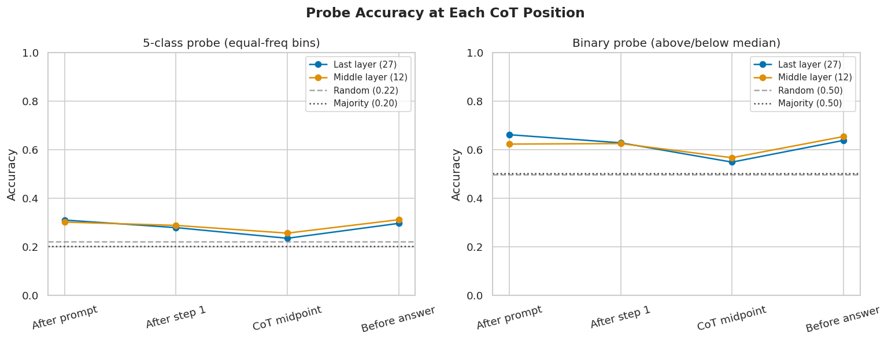
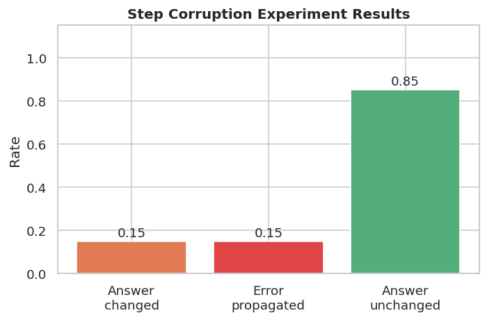
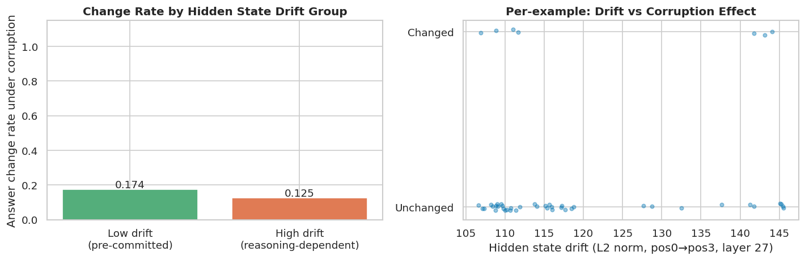

# Does the Chain of Thought Match the Hidden State?
### Probing Reasoning Faithfulness in a Small Language Model

**Nihal Gunukula, Sameer Murthy, Ayush Pai, Nirmal Senthilkumar**
CS 490: Natural Language Processing · Spring 2026 · Purdue University

---

## Overview

Chain-of-thought (CoT) prompting assumes that the reasoning steps a model writes reflect how it actually arrives at its answer. We test this assumption by applying **linear probing** to the hidden states of [DeepSeek-R1-Distill-Qwen-1.5B](https://huggingface.co/deepseek-ai/DeepSeek-R1-Distill-Qwen-1.5B) on [GSM8K](https://huggingface.co/datasets/openai/gsm8k) math problems.

**Two experiments:**
1. **Answer Probing** — Can a linear probe predict the final answer from hidden states *before* the model finishes reasoning? High early accuracy → the model already "knows" the answer before writing it (post-hoc rationalization).
2. **Step Corruption** — Does corrupting an intermediate arithmetic result change the final answer? Low sensitivity → the model ignores its own written reasoning steps.

**Novel cross-check:** We compare per-example probe confidence with corruption sensitivity to see if the same examples show both signals simultaneously.

---

## Repository Structure

```
cot-hidden-state-probing/
├── src/
│   ├── generate_cot.py   # Run model on GSM8K, save CoT traces + hidden states
│   ├── probe.py          # Train logistic regression probes at 4 CoT positions
│   ├── corrupt.py        # Corrupt intermediate steps, measure answer change rate
│   ├── analyze.py        # Generate all figures and print summary tables
│   └── utils.py          # Shared utilities (answer extraction, binning, parsing)
├── scripts/
│   ├── generate_train.sh # SLURM job: generate train split
│   ├── generate_test.sh  # SLURM job: generate test split
│   ├── probe.sh          # SLURM job: train probes
│   └── corrupt.sh        # SLURM job: corruption experiment
├── results/
│   ├── probe_results.json
│   ├── corruption_results.json
│   └── figures/
│       ├── probe_accuracy_curve.png
│       ├── corruption_bar.png
│       └── crosscheck.png
└── requirements.txt
```

---

## Setup

```bash
conda create -n cot-probe python=3.10 -y
conda activate cot-probe
pip install -r requirements.txt
```

---

## Running the Experiments

Run in order — each step depends on the previous.

### 1. Generate CoT traces and hidden states
```bash
# ~1h 48min (train) and ~3h (test) on a single GPU
python src/generate_cot.py --split train --n 500  --out results/hidden_states_train.jsonl
python src/generate_cot.py --split test  --n 1319 --out results/hidden_states_test.jsonl
```
Use `--resume` to continue an interrupted run.

### 2. Train probes (CPU, ~minutes)
```bash
python src/probe.py \
    --train results/hidden_states_train.jsonl \
    --test  results/hidden_states_test.jsonl \
    --out   results/probe_results.json
```

### 3. Step corruption experiment (~4h on GPU)
```bash
python src/corrupt.py \
    --hidden-states results/hidden_states_test.jsonl \
    --probe-results results/probe_results.json \
    --out results/corruption_results.json \
    --n 200
```

### 4. Analyze and generate figures
```bash
python src/analyze.py
# Figures saved to results/figures/
```

---

## Model & Data

| | |
|---|---|
| **Model** | [DeepSeek-R1-Distill-Qwen-1.5B](https://huggingface.co/deepseek-ai/DeepSeek-R1-Distill-Qwen-1.5B) |
| **Dataset** | [GSM8K](https://huggingface.co/datasets/openai/gsm8k) (500 train / 1,319 test) |
| **Probe** | Logistic regression (L2, C=1.0) on last transformer layer hidden states |
| **Probe target** | GSM8K ground-truth answer bucketed into 5 equal-frequency bins |
| **Generation** | Greedy decoding (temperature=0), inference only — no fine-tuning |

---

## Probe Positions

Hidden states are extracted at 4 positions during CoT generation:

| Position | Description |
|---|---|
| `pos0` | End of problem prompt, before any reasoning |
| `pos1` | After the first reasoning step |
| `pos2` | Midpoint of the CoT |
| `pos3` | Just before `</think>`, after all reasoning |

---

## Results

### Probe Accuracy


### Step Corruption


### Cross-check: Hidden State Drift vs Corruption Sensitivity


---

## References

- Wei et al. (2022). Chain-of-thought prompting elicits reasoning in large language models. *NeurIPS*.
- Turpin et al. (2024). Language models don't always say what they think. *NeurIPS*.
- Lanham et al. (2023). Measuring faithfulness in chain-of-thought reasoning. *arXiv:2307.13702*.
- DeepSeek-AI (2025). DeepSeek-R1. *arXiv:2501.12948*.
- Belinkov (2022). Probing classifiers. *Computational Linguistics*.
- Li et al. (2024). Inference-time intervention. *NeurIPS*.
